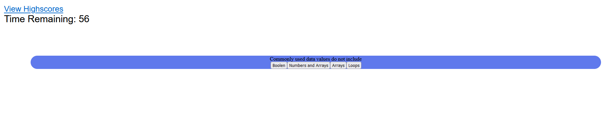

# Code-Quiz4

Challenge 4-- Code Quiz
    Created via VSCode

    Utilizing javascript to create a quiz that goes from question to question whilst on a timer

    This timer decreases in time when an question is answered incorrectly

Project found on [Github](https://tristinnguyen.github.io/Code-Quiz4/)

